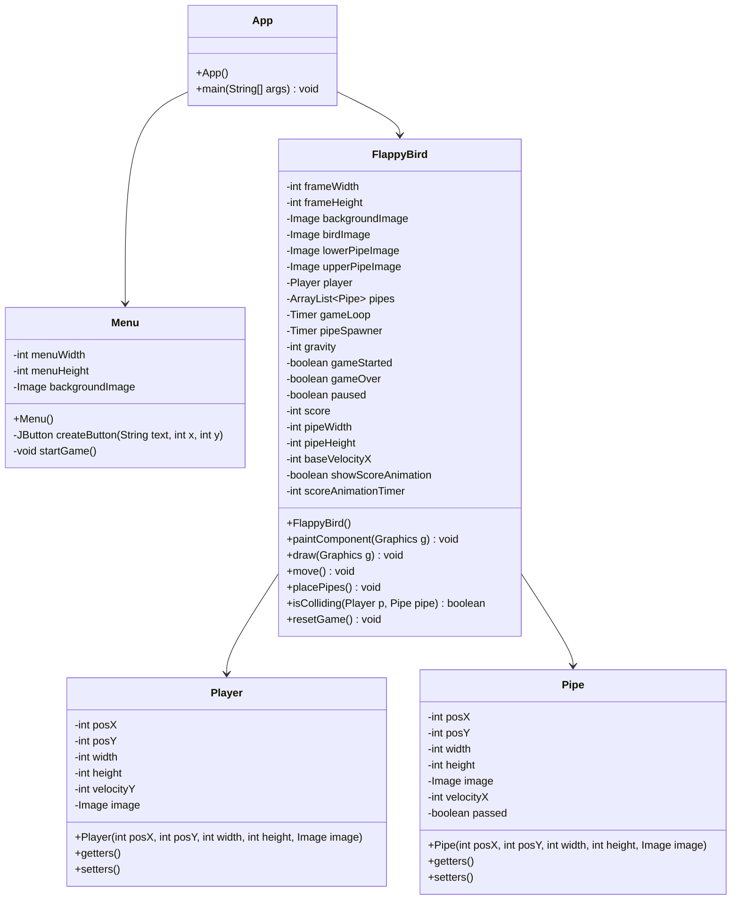

# Desain dan Pemrograman Berbasis Objek

---

## Tugas Praktikum 6

---

### Janji

---

Saya Fariz Wibisono dengan NIM 2307589 mengerjakan Tugas Praktikum 6 dalam mata kuliah Desain dan Pemrograman Berorientasi Objek untuk keberkahanNya maka saya tidak melakukan kecurangan seperti yang telah dispesifikasikan. Aamiin.

### Dokumentasi

---

Berikut adalah dokumentasi berupa rekaman hasil implementasi program:

<div align="center">
   <video src="" controls style="width: 100%;"></video>
</div>

### Diagram Kelas

---

Berikut adalah diagram kelas untuk game Flappy Bird:



### Penjelasan Alur Program

---

Program ini merupakan implementasi game Flappy Bird menggunakan Java Swing. Berikut penjelasan detail alur program:

1. **Halaman Menu**:
   - Saat program dijalankan, halaman menu ditampilkan dengan tombol "Start Game" dan "Exit"
   - Background game ditampilkan sebagai latar belakang menu

2. **Gameplay**:
   - Pemain mengontrol burung dengan menekan tombol spasi untuk terbang
   - Burung harus melewati pipa tanpa menyentuhnya
   - Setiap pipa yang berhasil dilewati akan menambah skor
   - Kecepatan pipa akan meningkat seiring bertambahnya skor

3. **Fitur Game**:
   - Tombol spasi untuk memulai game dan membuat burung terbang
   - Tombol P untuk menjeda/melanjutkan permainan
   - Tombol R untuk memulai ulang permainan setelah game over
   - Animasi skor saat berhasil melewati pipa
   - Level kesulitan meningkat seiring bertambahnya skor

4. **Akhir Game**:
   - Game berakhir jika burung menyentuh pipa atau jatuh ke dasar layar
   - Pemain dapat memulai ulang permainan dengan menekan tombol R

### Desain Sistem

---

Game Flappy Bird ini dirancang dengan pendekatan Object-Oriented Programming (OOP) dengan beberapa kelas utama:

#### Kelas Utama
- **App.java**: Kelas utama yang menginisialisasi game
  - Method: main(), konstruktor App()

- **Menu.java**: Kelas untuk menampilkan menu utama game
  - Atribut: menuWidth, menuHeight, backgroundImage
  - Method: createButton(), startGame()

- **FlappyBird.java**: Kelas inti yang mengelola gameplay
  - Atribut: frameWidth, frameHeight, player, pipes, score, dll
  - Method: move(), draw(), placePipes(), isColliding(), resetGame()

#### Kelas Model
- **Player.java**: Kelas yang merepresentasikan karakter burung
  - Atribut: posX, posY, width, height, velocityY, image
  - Method: getter dan setter untuk setiap atribut

- **Pipe.java**: Kelas yang merepresentasikan rintangan pipa
  - Atribut: posX, posY, width, height, image, velocityX, passed
  - Method: getter dan setter untuk setiap atribut

### Implementasi Konsep OOP

---

Game Flappy Bird ini menerapkan konsep-konsep OOP sebagai berikut:

1. **Encapsulation**: 
   - Atribut pada semua kelas dienkapsulasi (private) dan diakses melalui getter dan setter
   - Implementasi logika game tersembunyi dalam metode-metode kelas FlappyBird

2. **Inheritance**:
   - FlappyBird mewarisi JPanel untuk implementasi rendering grafis
   - Menu mewarisi JFrame untuk implementasi window utama

3. **Abstraction**:
   - Detail implementasi gameplay disembunyikan dalam metode-metode kelas FlappyBird
   - Interaksi dengan objek game (Player, Pipe) dilakukan melalui interface yang jelas

4. **Composition**:
   - FlappyBird menggunakan objek Player dan Pipe (komposisi)
   - App menggunakan objek FlappyBird dan JFrame

### Implementasi Java Swing

---

Game ini mengimplementasikan Java Swing untuk interface grafis:

1. **Komponen UI**:
   ```java
   JFrame frame = new JFrame("Flappy Bird");
   frame.setDefaultCloseOperation(JFrame.EXIT_ON_CLOSE);
   frame.setSize(360, 640);
   ```

2. **Event Handling**:
   ```java
   @Override
   public void keyPressed(KeyEvent e) {
       if (e.getKeyCode() == KeyEvent.VK_SPACE) {
           if (!gameStarted) {
               gameStarted = true;
           } else if (!gameOver && !paused) {
               player.setVelocityY(-10);
           }
       }
   }
   ```

3. **Custom Rendering**:
   ```java
   public void paintComponent(Graphics g) {
       super.paintComponent(g);
       g.drawImage(backgroundImage, 0, 0, frameWidth, frameHeight, null);
       g.drawImage(player.getImage(), player.getPosX(), player.getPosY(), 
                   player.getWidth(), player.getHeight(), null);
   }
   ```

4. **Animation Timer**:
   ```java
   gameLoop = new Timer(1000 / 60, this);
   gameLoop.start();
   ```

### Instalasi dan Penggunaan

---

1. **Prasyarat**:
   - Java JDK 8 atau lebih tinggi
   - IDE Java (IntelliJ IDEA, Eclipse, NetBeans)

2. **Langkah Instalasi**:
   - Clone atau download repository ini
   - Buka project menggunakan IDE Java
   - Pastikan struktur direktori assets terjaga untuk akses gambar
   - Compile dan jalankan kelas App.java

3. **Cara Bermain**:
   - Tekan tombol "Start Game" di menu untuk memulai
   - Tekan SPACE untuk membuat burung terbang
   - Hindari pipa dengan menjaga ketinggian burung yang tepat
   - Tekan P untuk menjeda permainan
   - Tekan R untuk memulai ulang setelah game over
   - Coba dapatkan skor tertinggi!

4. **Fitur Khusus**:
   - Tingkat kesulitan adaptif berdasarkan skor
   - Animasi visual saat mendapatkan poin
   - Menu pause dengan informasi kontrol